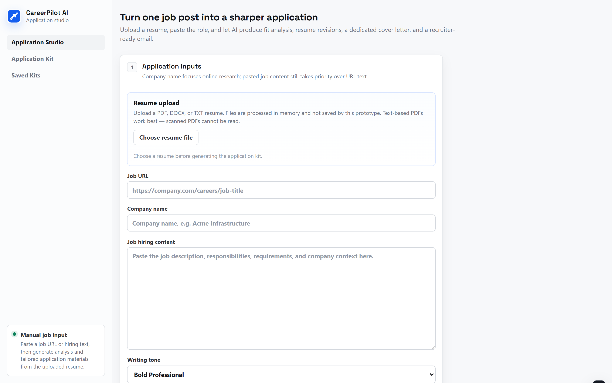
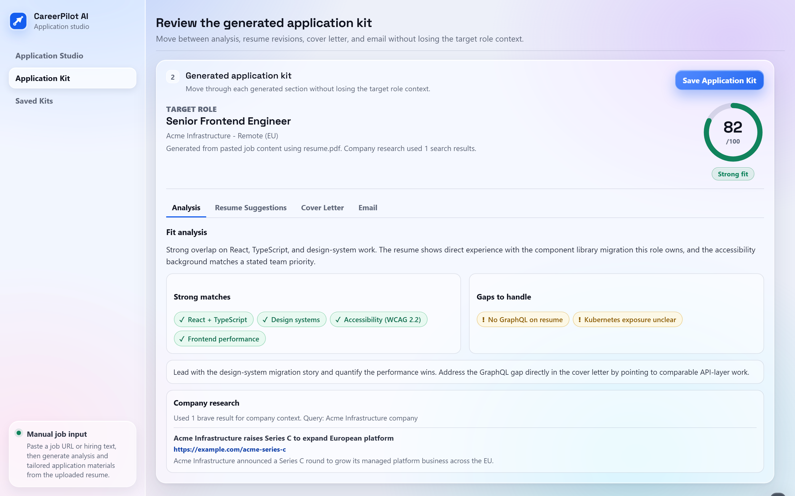
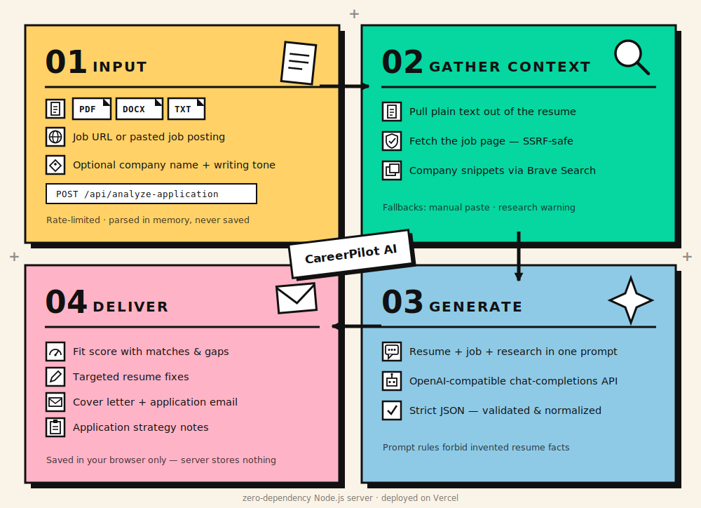

# CareerPilot AI Application Studio Prototype

This workspace includes a dependency-free MVP for resume-based job application analysis.

## Live Version

[Open CareerPilot AI Application Studio](https://careerpilot-ai-application-studio.vercel.app)

The backend calls any OpenAI-compatible chat-completions API; the active model is whatever `LLM_MODEL` is configured to on the deployment.

## Screenshots

Application Studio — upload a resume and paste the target role:



Generated application kit — fit score ring, match/gap analysis, and company research:



Users upload a resume, paste a job URL or the job hiring content, and generate:

- Job-fit analysis
- Resume revision suggestions
- A dedicated cover letter
- A concise application email
- Saved application kits for follow-up (stored in the user's own browser via localStorage)

## How It Works



## Run

Create a local `.env` file first:

```bash
LLM_API_KEY='your_llm_api_key_here'
LLM_BASE_URL='https://api.openai.com/v1'
LLM_MODEL='gpt-4.1-mini'
BRAVE_SEARCH_API_KEY='your_brave_search_api_key_here'
BRAVE_SEARCH_API_ENDPOINT='https://api.search.brave.com/res/v1/web/search'
SEARCH_CACHE_TTL_MS='900000'
RESUME_UPLOAD_MAX_BYTES='2000000'
APPLICATION_REQUEST_MAX_BYTES='3000000'
JOB_PAGE_FETCH_TIMEOUT_MS='8000'
JOB_PAGE_MAX_BYTES='750000'
GENERATION_RATE_LIMIT_WINDOW_MS='600000'
GENERATION_RATE_LIMIT_MAX='5'
```

Then start the app:

```bash
npm start
```

Open:

```text
http://localhost:3000
```

## What It Implements

- Resume upload for PDF, DOCX, and TXT (text-based PDFs work best; scanned PDFs cannot be read)
- Manual job URL input
- Manual pasted job-description input
- URL fetching with public-URL validation (private/local hosts, private DNS answers, and unvalidated redirects are rejected)
- Company research through the configured Brave Search API
- Clear manual-paste fallback when a job URL cannot be read reliably
- Staged progress bar during analysis and generation
- OpenAI-compatible LLM generation through the backend
- Structured application kit rendering
- Saved application kit tracker (browser localStorage, per-browser, capped at 30 kits)
- Per-IP rate limiting on the generation endpoints

## API Endpoints

```text
POST /api/analyze-application
POST /api/analyze-resume
```

Retired endpoints (job search, server-side kit storage) return `410 Gone`. Saved kits now live entirely in the browser.

## Rate Limiting

`POST /api/analyze-application` and `POST /api/analyze-resume` are limited per client IP (`GENERATION_RATE_LIMIT_MAX` requests per `GENERATION_RATE_LIMIT_WINDOW_MS`, default 5 per 10 minutes). Exceeding the limit returns `429` with a `Retry-After` header.

Note: the limiter is in-memory and per-serverless-instance on Vercel — it deters casual abuse but is not a hard guarantee. Do not treat it as billing protection for high-value API keys.

## Application Analysis Note

`POST /api/analyze-application` accepts `multipart/form-data`:

```text
resume      required file, PDF/DOCX/TXT
jobUrl      optional URL
companyName optional company name used to focus online company research
jobText     optional pasted job content
writingTone optional, defaults to Bold Professional
```

Manual pasted job content takes priority over fetched URL content. If the URL cannot be fetched or does not contain enough readable job text, the backend returns `422` with `needsManualPaste: true`.

Before calling the LLM, the backend searches online through `BRAVE_SEARCH_API_KEY` and passes company-background snippets into the application-analysis prompt. If `companyName` is provided, it is used as the research target; otherwise the backend falls back to inferring the company from the job URL or pasted content. If the search API is not configured or fails, generation can still continue, but the returned kit includes a company-research warning.

Uploaded resumes are processed in memory by this prototype and are not saved to disk.
